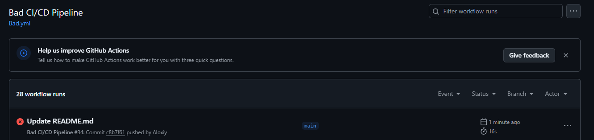
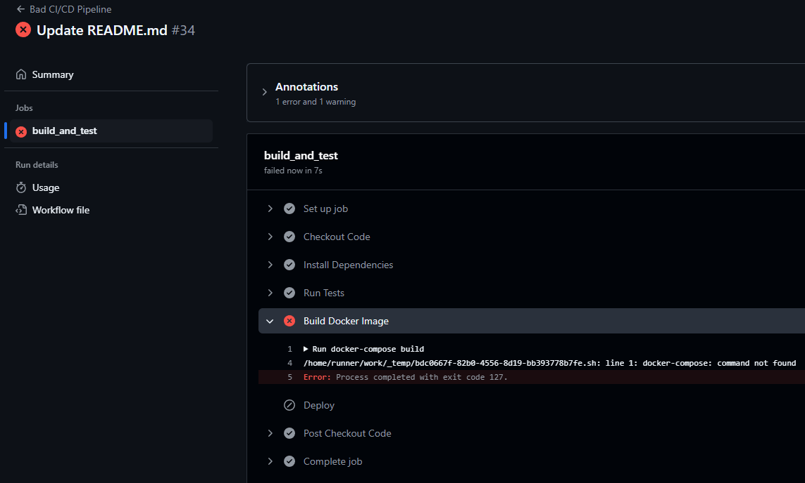

# Лабораторная №3 по DevOps

### Выполнили:

**Орлова Алёна (К3223)**  
**Феофанов Никита (К3222)**  
**Зубов Алексей (К3220)**  

---

## **Задание**

1. Написать “плохой” CI/CD файл, который работает, но в нём есть не менее пяти “bad practices” по написанию CI/CD.  
2. Написать “хороший” CI/CD, в котором эти плохие практики исправлены.  
3. В Readme описать каждую из плохих практик в плохом файле, почему она плохая и как в хорошем она была исправлена, как исправление повлияло на результат.  
4. Прочитать историю про Васю (она быстрая, забавная и того стоит): https://habr.com/ru/articles/689234/  

---

## **Что вообще такое CI- и CD-файлы?**

Перед выполнением лабораторной мы решили разобраться, что это за файлы и зачем они нужны.  

- **CI** или **Continuous Integration** — это концепция непрерывной интеграции. Такие файлы запускают автоматическое тестирование и интеграцию изменений в код, чтобы убедиться, что всё работает правильно.  

- **CD** или **Continuous Delivery/Deployment** — это концепция непрерывной доставки или развёртывания кода. После успешного прохождения тестов, код автоматически развёртывается на сервере или доставляется для последующей реализации.  

Файлы с такими инструкциями пишутся в формате **YAML** и называются **пайплайнами**. В нашей лабораторной задаче нужно было создать два пайплайна: хороший и плохой.  

---

## **Плохой CI/CD-файл**

Мы написали следующий CI/CD файл для GitHub Actions, в котором продемонстрировали 5 “bad practices”:

```yaml
name: Bad CI/CD Pipeline

on: push

jobs:
  build_and_test:
    runs-on: ubuntu-latest  # 2. Использование последней версии Ubuntu
    steps:
      - name: Checkout Code
        uses: actions/checkout@v3

      - name: Install Dependencies
        run: npm install  # 3. Использование npm install вместо npm ci

      - name: Run Tests
        run: ./run_tests.sh || true  # 4. Игнорирование результатов тестов

      - name: Build Docker Image
        run: docker-compose build  # 5. Использование устаревшей установки docker-compose

      - name: Deploy
        run: ssh user@server "docker-compose up -d"  # 6. Небезопасный SSH-доступ
```

---

### **Какие в нём ошибки?**

1. **Использование последней версии Ubuntu**:  
   - `ubuntu-latest` может вызывать непредсказуемые проблемы из-за несовместимости.  

2. **Использование npm install**:  
   - Эта команда может изменять зависимости в `package-lock.json`, что приводит к различиям между окружениями.  

3. **Игнорирование результатов тестов**:  
   - Пайплайн продолжает выполняться, даже если тесты завершились с ошибкой.  

4. **Использование docker-compose**:  
   - Установка `docker-compose` вручную устарела, так как теперь поддерживается встроенная команда `docker compose`.  

5. **Небезопасный SSH-доступ**:  
   - Прямой доступ через SSH без ключевой авторизации является уязвимым для атак.  

---

## **Хороший CI/CD-файл**

Исправив ошибки, мы написали следующий пайплайн:

```yaml
name: Good CI/CD Pipeline

on: push

jobs:
  build_and_test:
    runs-on: ubuntu-20.04  # Фиксированная версия Ubuntu
    steps:
      - name: Checkout Code
        uses: actions/checkout@v3

      - name: Build and Test in Docker
        run: |
          docker compose build
          docker compose run --rm app ./run_tests.sh

  deploy:
    runs-on: ubuntu-20.04
    needs: build_and_test
    steps:
      - name: Checkout Code
        uses: actions/checkout@v3

      - name: Deploy to Server
        run: ssh -i ~/.ssh/deploy_key user@server "docker compose pull && docker compose up -d"
```

---

### **Как исправили?**

1. **Использование фиксированной версии Ubuntu**:  
   - Теперь используется версия `ubuntu-20.04`, что гарантирует стабильность пайплайна.  

2. **Убрали установку зависимостей на хосте**:  
   - Установка зависимостей перенесена внутрь `Dockerfile`.  

3. **Прерывание выполнения при ошибке в тестах**:  
   - Тесты теперь запускаются внутри Docker-контейнера, а их ошибки прерывают пайплайн.  

4. **Замена docker-compose на docker compose**:  
   - Используется встроенная команда `docker compose`, что устранило необходимость установки `docker-compose`.  

5. **Настроен безопасный SSH-доступ**:  
   - Теперь используется ключевая авторизация для SSH.  

---

### **Как исправления повлияли на результат?**

- **Стабильность**: Зафиксированные версии Ubuntu и зависимостей исключают неожиданные проблемы.  
- **Безопасность**: SSH-доступ стал защищённым.  
- **Скорость и простота**: Упрощение пайплайна за счёт объединения этапов и использования встроенных команд.  
- **Предсказуемость**: Установка зависимостей теперь полностью контролируется через Docker.  

---

# Скриншоты

Для того чтобы сделать скриншоты были созданы файлы Bad.yml и Good.yml в директории ".githubs/workflows". Но их текст в некоторых местах отличается от написаного в этом README файле, потому что не все условия выполнялись и некоторые проверки были провальны. Поэтому в некоторых местах написано 'run: echo "Skipping deploy step for now"', таким образом удалось посмотреть что все првоерки файла Bad.yml возможно пройти. Для файла Good.yml, был поменят только блок build, чтобы хотя бы он прошел все проверки, остальные блоки поменяты не были. Чтобы более подробно посмотреть на это, можно напрямую посмотреть pipelines.






# После прочтения история про васю ( :) )


